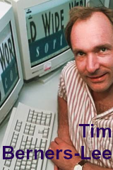

# **Jogo da Memória**

### Esse repositório foi inspirado nos programadores mais importântes na história da computação. Com certeza está faltando mais gente aqui, mas como não dava para colocar todos, fica pra próxima.
#

### Que tal jogar? 😁:

- <a href="https://igorios.github.io/jogo-da-memoria/">Clique aqui!</a> 👈😎
#

## Clone esse repositório: 

~~~~
    $ git clone https://github.com/Igorios/jogo-da-memoria.git
~~~~
#

###  Conheça um pouco dos personagens do jogo
 

- Esse é o Bill Gates. Um dos fundadores da Microsoft. O primeiro e único programador a receber o título de **mais rico do mundo.**
#

- Primeira mulher a trabalhar na **industria de games** na história.
#

- Considerado o pai da ciência computacional e da I.A, criou à **Máquina de Turing** que operava em sistema binário.
#

- Foi almirante e analista de sistema da Marinha dos Estados Unidos da América. **Criou o COBOL**, a primeria linguagem de computador da história.

- Foi responsável pela **criação do Linux e o Git.** Duas tecnologias de grande importância no mundo contemporâneo
#

- A cientista da computação e engenheira de software desenvolveu o programa de voo usado na Apollo 11, levando os **primeiros seres humanos à Lua.**
#

- Um dos **fundadores do Facebook.** A rede social mais acessada no mundo.
#

- Ele é um físico britânico, cientista da computação e professor do MIT. Famoso pela **criação do World Wide Web,** *WWW* para os intímos.
#

## **Tecnologias usadas no projeto:**

#
